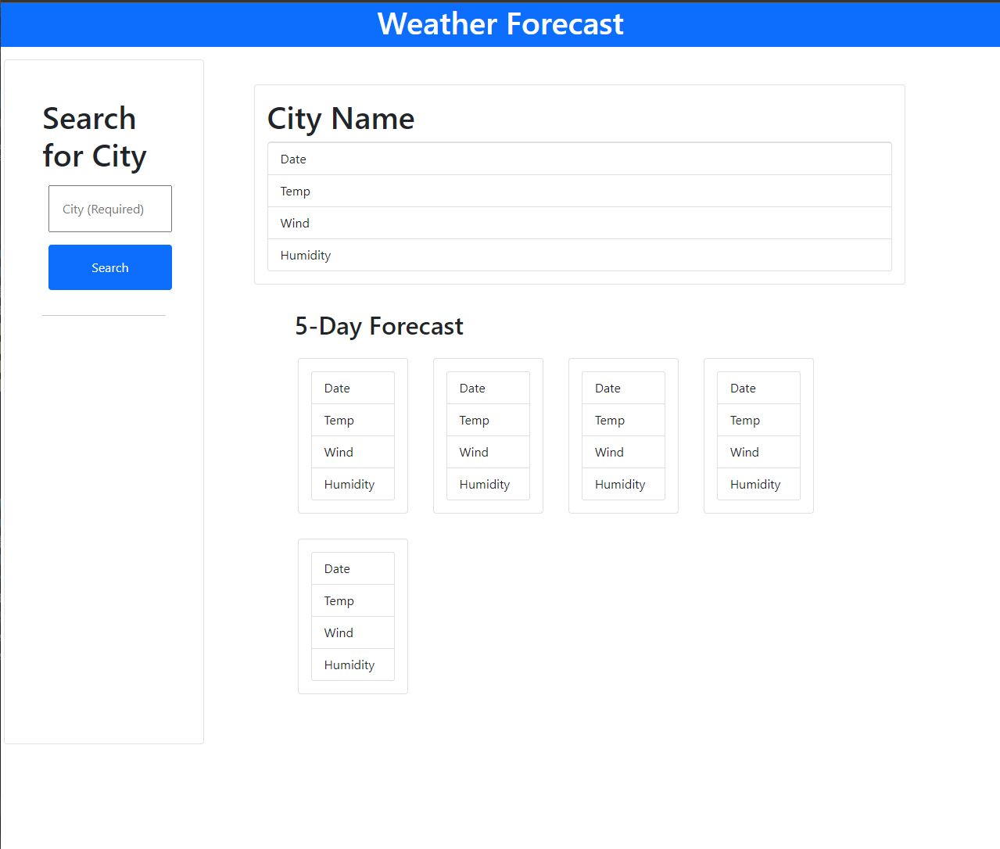

# Challenge 6

## Acceptance Criteria

```
GIVEN a weather dashboard with form inputs
WHEN I search for a city
THEN I am presented with current and future conditions for that city and that city is added to the search history
WHEN I view current weather conditions for that city
THEN I am presented with the city name, the date, an icon representation of weather conditions, the temperature, the humidity, and the wind speed
WHEN I view future weather conditions for that city
THEN I am presented with a 5-day forecast that displays the date, an icon representation of weather conditions, the temperature, the wind speed, and the humidity
WHEN I click on a city in the search history
THEN I am again presented with current and future conditions for that city
```

## Photo of Website Functionality
The following Photo shows the web application's appearance and functionality:




# Explanation of what was done

Made a wether api website!
Once you search up a city its weather forcast for today and the next 5 days comes up, along with the date, temp, wind, and humidity!

inpiration for the ui came from kendall bliss (thanks kendall!)

used tommorow.io api for the weather calls